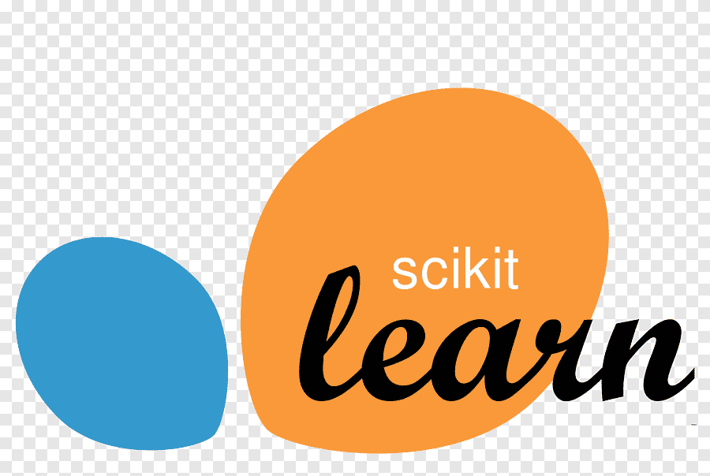

## Hi there 👋

My name's Ilia Shorokhov. I am Data Scientist, Team Leader and Mentor. 

## About me
- Working at Avito
- 5 years in IT
- 3 years as Team Leader
- 1 year in Data Science

## Skills
### Programming Languages

### Libraries and Frameworks
 Pandas
 NumPy
 Scikit-Learn
 Matplotlib
 PyTorch
 TensorFlow
 Keras
 Apache Spark
 PostgreSQL

## Contact Me
- [Email](mailto:iliashorokhov@yandex.ru)
- [Telegram](https://t.me/iashorokhov)
- [GitHub](https://github.com/iashorokhov)

